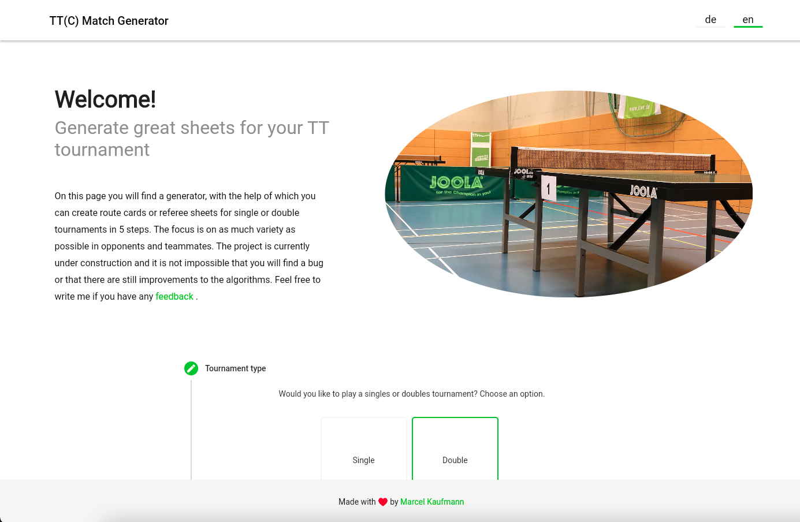
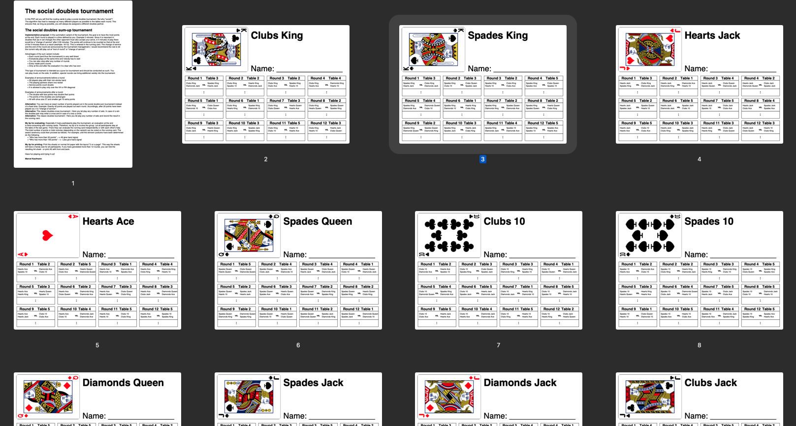

# TTC Tournament Generator

**🎨 Flutter Web + 🏋️‍♂️ JS Web Worker API + 🦀 Rust and wasm-bindgen**

Single page application with a generator that helps you create awesome tournaments

This project is in an early alpha. Feel free to contribute or provide feedback by creating an issue.

You can find this website [here](http://ttc-match-generator.flocksserver.de/).
### Website

### PDF

## Build

All important commands can be found in the [Makefile](Makefile)

### Prerequisite

You need the following dependencies installed:
* [rust](https://www.rust-lang.org/tools/install)
* [wasm-pack](https://rustwasm.github.io/wasm-pack/installer/)
* [flutter](https://flutter.dev/docs/get-started/install)

## Related Dependencies

Two rust main packages are used to calculate the tournaments.
* [Social Tournament](https://github.com/Flocksserver/social_tournament)
* [Round Robin Tournament](https://github.com/Flocksserver/round_robin_tournament)

## License

Licensed under either of

* Apache License, Version 2.0, ([LICENSE-APACHE](https://github.com/Flocksserver/social_tournament/blob/master/LICENSE_APACHE) or https://www.apache.org/licenses/LICENSE-2.0)
* MIT license ([LICENSE-MIT](https://github.com/Flocksserver/social_tournament/blob/master/LICENSE_MIT) or https://opensource.org/licenses/MIT)

at your option.

### Contribution

Unless you explicitly state otherwise, any contribution intentionally
submitted for inclusion in the work by you, as defined in the Apache-2.0
license, shall be dual licensed as above, without any additional terms or
conditions.